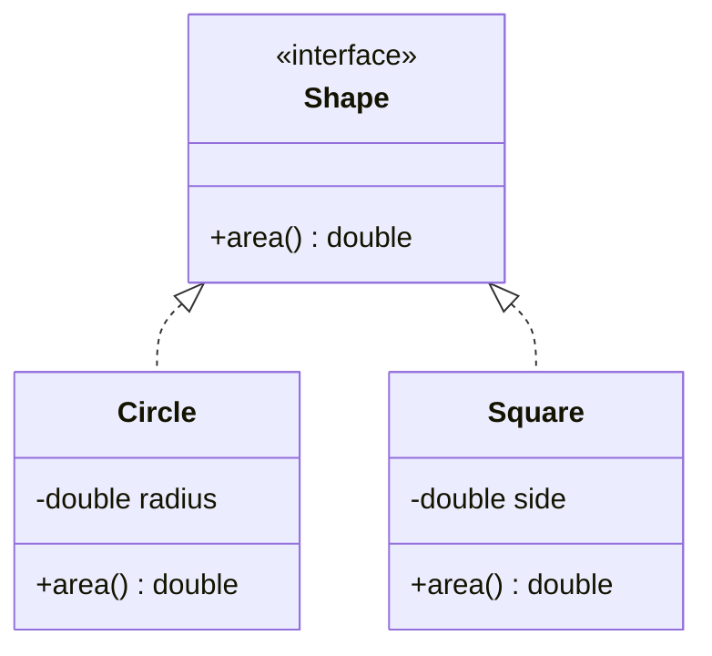
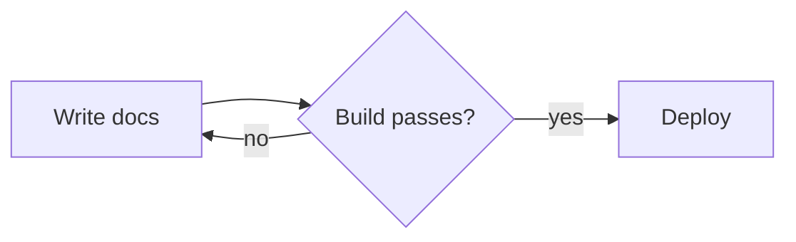

# Diagrams

With `mermaid: true` under `theme`, fenced `mermaid` blocks render as diagrams in the Sorrow palette.

## Class diagram

```mermaid
classDiagram
    class Shape {
        <<interface>>
        +area() double
    }
    class Circle {
        -double radius
        +area() double
    }
    class Square {
        -double side
        +area() double
    }
    Shape <|.. Circle
    Shape <|.. Square
```

## Flowchart

```mermaid
flowchart LR
    A[Write docs] --> B{Build passes?}
    B -- yes --> C[Deploy]
    B -- no --> A
```
